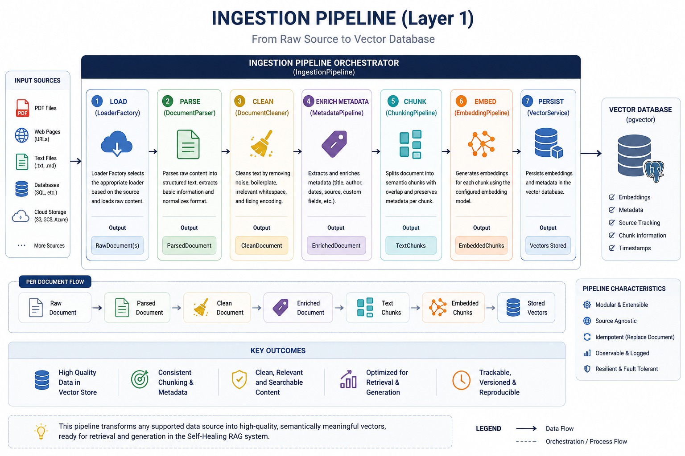
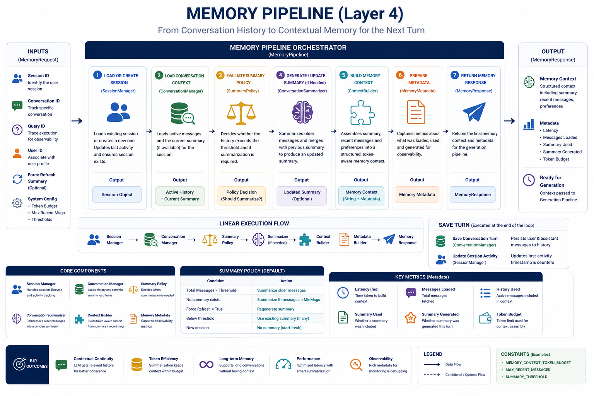
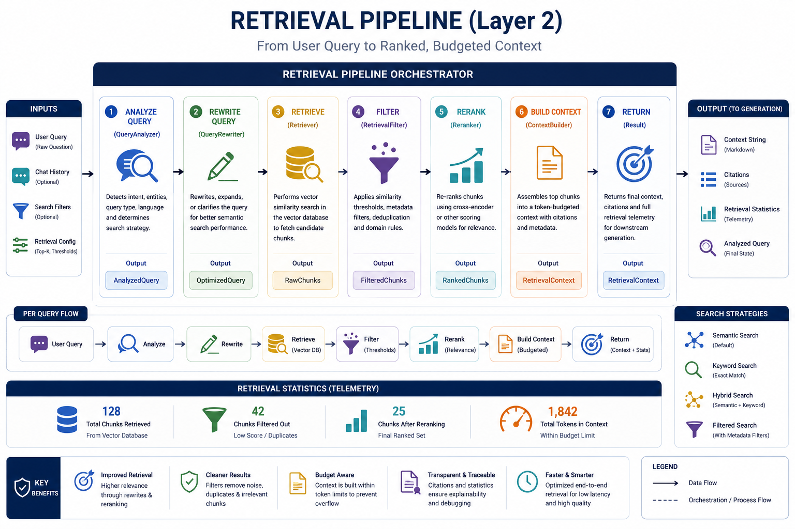
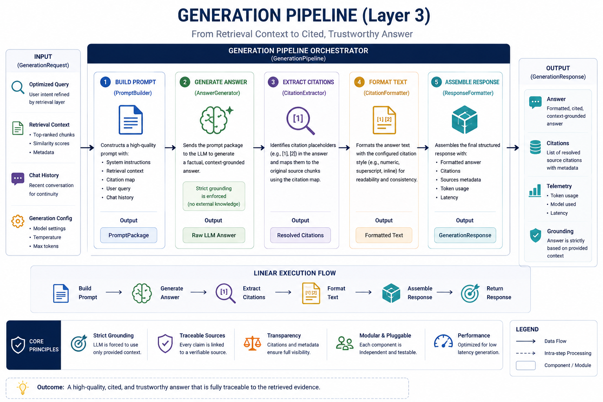
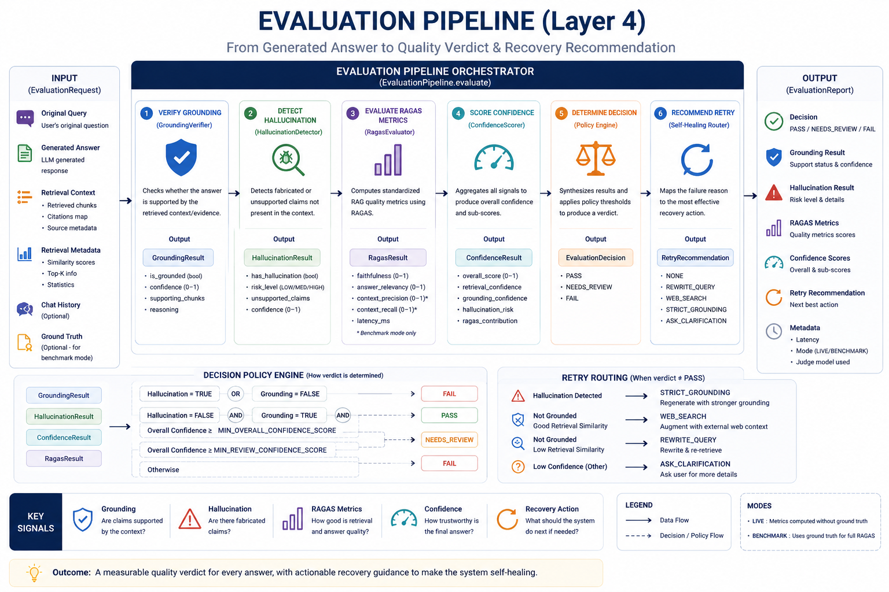
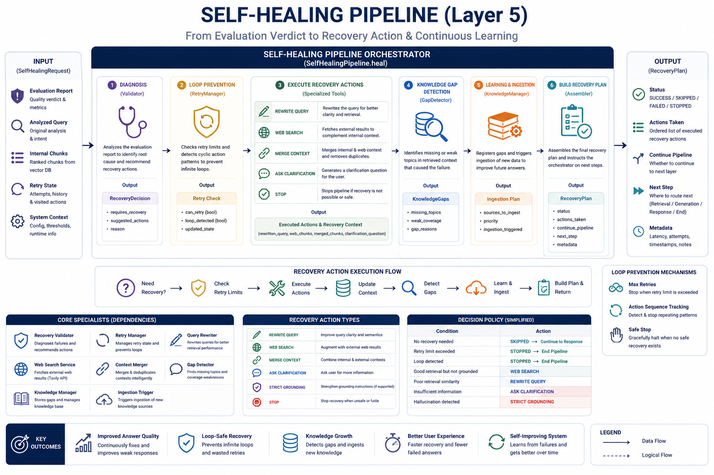
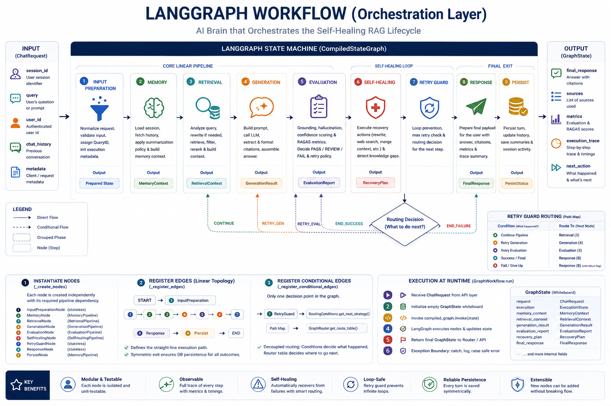

<div align="center">

# 🧠 Self-Corrective RAG
### *Evaluation-Driven Retrieval-Augmented Generation with Autonomous Recovery & LangGraph Orchestration*

<p align="center">
  
  
  
  
  
  
  
  
  
  
</p>

### 🚀 A Production-Ready Self-Corrective Retrieval-Augmented Generation Framework that **evaluates**, **diagnoses**, and **recovers** from retrieval failures and hallucinations before delivering grounded, trustworthy AI responses.

<p align="center">

[🌐 Live API](https://self-healing-rag-api-v3.onrender.com) •
[📖 API Docs](https://self-healing-rag-api-v3.onrender.com/docs) •
[💻 GitHub Repository](https://github.com/shiwan-mangate/Self-Corrective-RAG)

</p>

</div>

---

# 📖 Overview

Large Language Models are only as reliable as the information they receive. Traditional Retrieval-Augmented Generation (RAG) systems retrieve relevant documents once, generate an answer, and immediately return it to the user—even when the retrieved context is incomplete, irrelevant, or hallucination-prone.

**Self-Corrective RAG** introduces an evaluation-driven architecture that continuously validates every generated response before it reaches the user. Instead of assuming retrieval succeeded, the system performs multiple quality checks, diagnoses failures, automatically executes recovery strategies, and only then returns the final answer.

The entire workflow is orchestrated using **LangGraph**, enabling cyclic execution, intelligent routing, retry management, and autonomous recovery while maintaining conversation memory and long-term knowledge improvement.

Unlike conventional RAG systems, this framework doesn't stop after generation—it actively **thinks, evaluates, corrects, and learns**.

---

# ✨ Why Self-Corrective RAG?

Traditional RAG pipelines generally follow a simple linear workflow:

```
User Query
      │
      ▼
Retrieve Documents
      │
      ▼
Generate Answer
      │
      ▼
Return Response
```

This approach works well only when retrieval is perfect.

In real-world scenarios, failures occur frequently:

- Retrieved chunks may be irrelevant.
- Important knowledge may be missing.
- The LLM may hallucinate unsupported facts.
- Follow-up questions lose conversational context.
- Out-of-domain queries often fail silently.

Rather than returning unreliable answers, **Self-Corrective RAG** introduces an autonomous recovery layer that continuously monitors answer quality and dynamically repairs failures before responding.

Its execution lifecycle looks like:

```
User Query
      │
      ▼
Memory
      │
      ▼
Retrieval
      │
      ▼
Generation
      │
      ▼
Evaluation
      │
      ▼
Self-Healing
      │
      ▼
Retry Guard
      │
      ▼
Final Response
```

This architecture enables the system to recover from poor retrieval, hallucinations, missing knowledge, and low-confidence generations automatically.

---

# 🌟 Key Highlights

- 🧠 LangGraph-based cyclic AI workflow
- 📚 Multi-format document ingestion pipeline
- 🔍 Semantic retrieval using Hugging Face embeddings
- ✍️ Intelligent query rewriting
- 📑 Context-aware reranking and filtering
- 💬 Persistent conversational memory
- 🛡️ Strict context-grounded generation
- 📖 Automatic citation extraction
- 🚨 Hallucination detection
- 📊 Confidence scoring
- 📈 RAGAS-based evaluation framework
- 🔄 Autonomous self-healing recovery
- 🌐 Web search fallback using Tavily
- 🧩 Knowledge-gap detection
- 📥 Continuous knowledge ingestion
- 🚦 Retry guard to prevent infinite execution loops
- ⚡ FastAPI production API
- 🐳 Docker & Render deployment
- 🧪 Comprehensive Unit, Integration, and End-to-End testing

---

# 🔥 What Makes This Different?

Most RAG implementations stop after generating an answer.

**Self-Corrective RAG** adds an entire autonomous reasoning layer on top of traditional retrieval.

Instead of asking:

> **"Can the model answer this question?"**

it asks:

- **Was the retrieved context sufficient?**
- **Is the answer grounded in evidence?**
- **Did the model hallucinate?**
- **How confident is the final response?**
- **Should the system rewrite the query?**
- **Should external knowledge be fetched?**
- **Can this failure improve future responses?**

This transforms a standard RAG pipeline into an intelligent system capable of continuously improving response quality.

---

# 🚀 Live Demo

| Service | Link |
|---------|------|
| 🌐 Live API | https://self-healing-rag-api-v3.onrender.com |
| 📖 Swagger UI | https://self-healing-rag-api-v3.onrender.com/docs |
| 💻 GitHub Repository | https://github.com/shiwan-mangate/Self-Corrective-RAG |

---

# 📚 Table of Contents

- [📖 Overview](#-overview)
- [✨ Why Self-Corrective RAG?](#-why-self-corrective-rag)
- [🌟 Key Highlights](#-key-highlights)
- [🔥 What Makes This Different?](#-what-makes-this-different)
- [🚀 Live Demo](#-live-demo)
- [🏗️ System Architecture](#️-system-architecture)
- [⚙️ Pipeline Architecture](#️-pipeline-architecture)
- [🚀 Features & Technology](#-features--technology)
- [🛠️ Getting Started](#️-getting-started)
- [📡 API & Performance](#-api--performance)
- [🧪 Testing & Roadmap](#-testing--roadmap)
- [📄 License & Author](#-license--author)

  # 🏗️ System Architecture

Self-Corrective RAG is designed as a **modular, evaluation-driven AI system** where every stage of the Retrieval-Augmented Generation (RAG) lifecycle is isolated into independent subsystems and orchestrated through **LangGraph**.

Unlike traditional RAG pipelines that immediately return an LLM-generated response after retrieval, this framework continuously **evaluates**, **diagnoses**, **recovers**, and **learns** before producing the final answer.

At the center of the architecture is a cyclic LangGraph workflow that enables intelligent routing, autonomous recovery, conversation memory, and continuous knowledge improvement.

---

# 🎯 Why Self-Corrective RAG?

Modern Retrieval-Augmented Generation (RAG) systems significantly reduce hallucinations by grounding LLMs on retrieved documents. However, they still assume that the retrieval stage always succeeds.

In practice, this assumption frequently breaks.

Real-world enterprise knowledge bases continuously evolve, documents become outdated, user queries are ambiguous, and retrieved context is often incomplete or irrelevant. Once retrieval fails, conventional RAG systems continue generating answers from insufficient evidence, producing hallucinations or low-confidence responses without recognizing their own mistakes.

Self-Corrective RAG addresses this limitation by introducing an **Evaluation-Driven Feedback Loop**.

Instead of trusting every generated response, the system continuously verifies response quality, identifies failure causes, executes targeted recovery strategies, and improves the knowledge base whenever missing information is detected.

The result is an intelligent RAG architecture capable of **reasoning about its own failures before responding to users.**

---

# Traditional RAG vs Self-Corrective RAG

| Traditional RAG | Self-Corrective RAG |
|-----------------|--------------------|
| Single-pass pipeline | Cyclic feedback architecture |
| Retrieves once | Can retrieve multiple times |
| No quality verification | Evaluates every generated response |
| Hallucinations may reach users | Hallucinations are detected before response |
| Cannot recover from poor retrieval | Automatic recovery strategies |
| Static knowledge base | Continuous knowledge improvement |
| No retry mechanism | Intelligent retry routing |
| No long-term learning | Knowledge-gap detection & ingestion |
| Minimal observability | Full execution tracing and metrics |
| Linear execution | LangGraph-based orchestration |

---

# 🏢 Overall Enterprise Architecture

<p align="center">

> **Replace this with your enterprise architecture diagram**


</p>

The architecture is organized into independent, loosely coupled layers, each responsible for a specific stage of the AI lifecycle.

Every subsystem follows the **Single Responsibility Principle**, making the project highly modular, testable, maintainable, and extensible.

---

# 🔄 Complete AI Lifecycle

The complete execution lifecycle consists of seven specialized AI subsystems coordinated through LangGraph.

```text
                     User Query
                         │
                         ▼
              Input Preparation Layer
                         │
                         ▼
                 Memory Subsystem
                         │
                         ▼
               Retrieval Subsystem
                         │
                         ▼
               Generation Subsystem
                         │
                         ▼
               Evaluation Subsystem
                         │
                         ▼
             Self-Healing Subsystem
                         │
                         ▼
                Retry Guard Router
               ┌─────────┴─────────┐
               │                   │
      Continue Recovery      Return Response
               │                   │
               ▼                   ▼
        Retrieval / Generation   Persist Memory
```

Instead of following a simple linear pipeline, the workflow forms a **closed feedback loop** where every generated response is validated before reaching the user.

---

# 🧱 Layered Architecture

The framework is divided into specialized layers that collectively implement an enterprise-grade Self-Corrective RAG pipeline.

| Layer | Responsibility |
|--------|----------------|
| **Layer 0** | API Layer (FastAPI, Request Validation, Dependency Injection) |
| **Layer 1** | Document Ingestion & Vectorization |
| **Layer 2** | Conversation Memory Management |
| **Layer 3** | Semantic Retrieval & Context Construction |
| **Layer 4** | Context-Grounded Response Generation |
| **Layer 5** | Response Evaluation & Quality Verification |
| **Layer 6** | Autonomous Self-Healing & Recovery |
| **Layer 7** | LangGraph Orchestration & Intelligent Routing |
| **Infrastructure** | PostgreSQL, pgvector, Hugging Face Embeddings, Docker, Render |

Each layer exposes a clean pipeline interface while hiding implementation details behind dependency injection, allowing components to evolve independently without affecting the rest of the system.

---

# ⚙️ End-to-End Workflow

The following illustrates how a user query travels through the entire system.

```text
┌──────────────────────────┐
│        User Query        │
└────────────┬─────────────┘
             │
             ▼
┌──────────────────────────┐
│ Input Preparation Layer  │
│ • Validation             │
│ • Normalization          │
│ • Execution Metadata     │
└────────────┬─────────────┘
             │
             ▼
┌──────────────────────────┐
│ Memory Pipeline          │
│ • Load Session           │
│ • Conversation History   │
│ • Context Summary        │
└────────────┬─────────────┘
             │
             ▼
┌──────────────────────────┐
│ Retrieval Pipeline       │
│ • Query Analysis         │
│ • Query Rewriting        │
│ • Semantic Search        │
│ • Filtering              │
│ • Reranking              │
│ • Context Builder        │
└────────────┬─────────────┘
             │
             ▼
┌──────────────────────────┐
│ Generation Pipeline      │
│ • Prompt Construction    │
│ • LLM Generation         │
│ • Citation Extraction    │
│ • Response Formatting    │
└────────────┬─────────────┘
             │
             ▼
┌──────────────────────────┐
│ Evaluation Pipeline      │
│ • Grounding Verification │
│ • Hallucination Check    │
│ • Confidence Score       │
│ • RAGAS Evaluation       │
└────────────┬─────────────┘
             │
             ▼
┌──────────────────────────┐
│ Self-Healing Pipeline    │
│ • Recovery Diagnosis     │
│ • Query Rewrite          │
│ • Web Search             │
│ • Context Merge          │
│ • Knowledge Gap          │
└────────────┬─────────────┘
             │
             ▼
┌──────────────────────────┐
│ Retry Guard             │
│ • Prevent Infinite Loop │
│ • Route Next Step       │
└───────┬────────┬─────────┘
        │        │
        │Retry   │Success
        ▼        ▼
 Retrieval     Final Response
                  │
                  ▼
        Conversation Persistence
```

---

# 🧠 Architectural Principles

The architecture follows several software engineering principles that make it suitable for production AI systems.

- **Pipeline-Based Design** – Every subsystem has a single responsibility and exposes one public entry point.
- **Dependency Injection** – Components are loosely coupled and independently testable.
- **Evaluation-Driven Intelligence** – Responses are validated before being returned.
- **Autonomous Recovery** – The system attempts to repair failures without user intervention.
- **Continuous Learning** – Missing knowledge is identified and prepared for future ingestion.
- **Graph-Based Orchestration** – LangGraph coordinates execution, routing, retries, and recovery.
- **Observability First** – Every stage records latency, quality metrics, and execution metadata.
- **Production Ready** – Dockerized deployment with FastAPI, PostgreSQL, and Render support.

---

> **In the following section, we dive into each subsystem individually, exploring how the Ingestion, Memory, Retrieval, Generation, Evaluation, Self-Healing, and LangGraph pipelines work internally.**

# ⚙️ Pipeline Architecture

The Self-Corrective RAG framework is composed of multiple independent pipelines, each responsible for a single stage of the Retrieval-Augmented Generation lifecycle. Every pipeline is designed as an isolated, reusable module that can be developed, tested, and maintained independently while seamlessly integrating through the LangGraph orchestration layer.

Each pipeline follows a consistent design philosophy:

- **Single Responsibility Principle** – Each pipeline focuses on one core task.
- **Modular Components** – Internal stages are loosely coupled and independently testable.
- **Pipeline Orchestration** – Components execute sequentially to produce a structured output.
- **Production Ready** – Built with dependency injection, structured logging, and extensibility in mind.

The following sections describe the internal architecture of each pipeline.

---

# 📥 Ingestion Pipeline

<p align="center">

</p>

The **Ingestion Pipeline** is the foundation of the entire Self-Corrective RAG system. Its primary responsibility is to transform raw documents into high-quality vector representations that can be efficiently searched during retrieval.

Rather than simply splitting documents into chunks, the pipeline performs a complete preprocessing workflow including parsing, cleaning, metadata enrichment, semantic chunking, embedding generation, and vector storage.

By ensuring every document is standardized before indexing, the retrieval subsystem receives cleaner and more meaningful contextual information.

---

## 🎯 Purpose

Convert raw knowledge sources into semantically searchable vector embeddings that can later be retrieved by the Retrieval Pipeline.

---

## 🛠 Responsibilities

- Load documents from multiple sources
- Parse heterogeneous document formats
- Clean and normalize document content
- Extract and enrich metadata
- Split documents into semantic chunks
- Generate dense vector embeddings
- Persist vectors into PostgreSQL (pgvector)

---

## 📥 Inputs

The ingestion pipeline accepts knowledge from multiple sources, including:

- PDF documents
- Microsoft Word files
- Plain text files
- Markdown files
- Web pages
- Existing datasets
- Enterprise knowledge bases

---

## 📤 Outputs

After processing, the pipeline produces:

- Cleaned documents
- Metadata-enriched chunks
- High-quality vector embeddings
- Persistent vector records
- Search-ready knowledge base

---

## 🔄 Internal Workflow

```text
Raw Documents
      │
      ▼
Loader Factory
      │
      ▼
Document Parser
      │
      ▼
Document Cleaner
      │
      ▼
Metadata Pipeline
      │
      ▼
Chunking Pipeline
      │
      ▼
Embedding Pipeline
      │
      ▼
Vector Service
      │
      ▼
PostgreSQL + pgvector
```

---

## 🧩 Core Components

| Component | Responsibility |
|-----------|----------------|
| **Loader Factory** | Selects the appropriate document loader based on file type |
| **Document Parser** | Extracts readable content from raw files |
| **Document Cleaner** | Removes noise, formatting artifacts, and invalid text |
| **Metadata Pipeline** | Enriches documents with structured metadata for filtering and retrieval |
| **Chunking Pipeline** | Splits documents into semantically meaningful chunks |
| **Embedding Pipeline** | Converts text chunks into dense vector representations |
| **Vector Service** | Stores embeddings and metadata inside PostgreSQL using pgvector |

---

## 💡 Why It Matters

The quality of retrieval is directly determined by the quality of document ingestion.

A well-designed ingestion pipeline ensures:

- Higher retrieval accuracy
- Better semantic matching
- Reduced retrieval noise
- Improved context quality
- Lower hallucination rates during generation

In short, **better ingestion leads to better retrieval, which ultimately leads to more reliable AI responses.**

---

# 🧠 Memory Pipeline

<p align="center">

</p>

The **Memory Pipeline** enables the system to maintain conversational continuity across multiple interactions. Instead of treating every query as an isolated request, it preserves session history, retrieves relevant past conversations, manages long-term summaries, and constructs contextual memory for downstream pipelines.

This allows the LLM to understand follow-up questions, resolve references, and generate responses that remain consistent throughout an ongoing conversation.

---

## 🎯 Purpose

Provide contextual memory by maintaining conversation history, session state, and summarized interactions across multiple user requests.

---

## 🛠 Responsibilities

- Create and manage user sessions
- Retrieve conversation history
- Load long-term summaries
- Generate updated summaries when required
- Assemble memory context
- Persist new conversation turns
- Maintain session metadata

---

## 📥 Inputs

The Memory Pipeline receives:

- Current user query
- Session identifier
- Previous conversation history
- Existing conversation summaries
- Runtime execution metadata

---

## 📤 Outputs

The pipeline produces:

- Structured conversation context
- Conversation history
- Long-term summaries
- Session metadata
- Memory package for Retrieval Pipeline
- Updated session state

---

## 🔄 Internal Workflow

```text
User Query
      │
      ▼
Session Loader
      │
      ▼
Conversation History
      │
      ▼
Summary Retrieval
      │
      ▼
Summary Evaluation
      │
      ▼
Summary Generation
      │
      ▼
Memory Context Builder
      │
      ▼
Memory Response
      │
      ▼
Conversation Persistence
```

---

## 🧩 Core Components

| Component | Responsibility |
|-----------|----------------|
| **Session Manager** | Creates or retrieves active conversation sessions |
| **Conversation Repository** | Loads previous dialogue history |
| **Summary Repository** | Retrieves long-term summaries for efficient context compression |
| **Summary Generator** | Produces updated summaries when conversations grow beyond token limits |
| **Memory Builder** | Combines history, summaries, and metadata into structured memory |
| **Persistence Layer** | Stores new conversation turns and updates session activity |

---

## 💡 Why It Matters

Large Language Models do not inherently remember previous interactions.

Without a memory layer:

- Follow-up questions lose context.
- Pronouns and references become ambiguous.
- Multi-turn conversations degrade quickly.
- Long discussions exceed token limits.

The Memory Pipeline solves these challenges by providing persistent conversational awareness while keeping prompts efficient through intelligent summarization.

This enables the system to deliver responses that are:

- Context-aware
- Consistent across conversations
- More personalized
- Token-efficient
- Better suited for long-running enterprise applications

---

# 🔍 Retrieval Pipeline

<p align="center">

</p>

The **Retrieval Pipeline** is the intelligence layer responsible for finding the most relevant knowledge required to answer a user's question. Rather than performing a simple vector similarity search, it analyzes the query, improves ambiguous questions, retrieves candidate documents, filters noisy results, reranks them by relevance, and constructs an optimized context package for the language model.

Its objective is to maximize **Context Precision** and **Context Recall**, ensuring that the Generation Pipeline receives only the most relevant and trustworthy information.

---

## 🎯 Purpose

Retrieve the most relevant contextual information from the knowledge base while minimizing irrelevant, duplicate, or low-quality results before response generation.

---

## 🛠 Responsibilities

- Analyze user intent
- Rewrite ambiguous queries
- Perform semantic vector search
- Retrieve candidate documents
- Filter irrelevant chunks
- Rerank retrieved results
- Build optimized context packages
- Collect retrieval statistics and metadata

---

## 📥 Inputs

The Retrieval Pipeline receives:

- User query
- Conversation memory
- Session context
- Search filters (optional)
- Runtime metadata

---

## 📤 Outputs

After execution, the pipeline produces:

- Retrieved document chunks
- Ranked contextual information
- Optimized context package
- Source metadata
- Retrieval statistics
- Retrieval confidence information

---

## 🔄 Internal Workflow

```text
User Query
      │
      ▼
Query Analyzer
      │
      ▼
Query Rewriter
      │
      ▼
Semantic Vector Search
      │
      ▼
Document Filtering
      │
      ▼
Relevance Reranking
      │
      ▼
Context Builder
      │
      ▼
Retrieval Context
```

---

## 🧩 Core Components

| Component | Responsibility |
|-----------|----------------|
| **Query Analyzer** | Understands user intent, identifies ambiguity, and prepares search parameters |
| **Query Rewriter** | Improves poorly structured or ambiguous queries for better retrieval quality |
| **Retrieval Engine** | Performs semantic similarity search over the vector database |
| **Filtering Module** | Removes duplicate, noisy, or low-confidence chunks |
| **Reranker** | Reorders retrieved documents according to semantic relevance |
| **Context Builder** | Combines the highest-quality chunks into a structured prompt-ready context |
| **Retrieval Metadata** | Records search statistics, confidence, and execution metrics |

---

## 💡 Why It Matters

Even the most advanced LLM cannot produce reliable answers without reliable context.

Poor retrieval results in:

- Missing information
- Irrelevant documents
- Context pollution
- Hallucinations
- Low-confidence responses

The Retrieval Pipeline improves answer quality by ensuring that only the most relevant and information-rich documents are passed to the language model.

This directly contributes to higher:

- Context Precision
- Context Recall
- Answer Relevancy
- Faithfulness

---

# ✨ Generation Pipeline

<p align="center">

</p>

The **Generation Pipeline** transforms the retrieved context into a coherent, grounded, and human-readable response. Instead of allowing the language model to freely generate text, the pipeline constructs carefully engineered prompts, enforces context grounding, extracts citations, and formats the final response with supporting evidence.

Its goal is to ensure that every answer remains faithful to the retrieved knowledge while maintaining clarity, completeness, and transparency.

---

## 🎯 Purpose

Generate context-grounded responses that are accurate, explainable, and supported by citations from retrieved knowledge.

---

## 🛠 Responsibilities

- Construct structured prompts
- Provide retrieved context to the LLM
- Generate grounded responses
- Extract supporting citations
- Format final responses
- Collect generation metadata
- Preserve traceability between answers and source documents

---

## 📥 Inputs

The Generation Pipeline receives:

- User query
- Conversation memory
- Retrieval context
- Ranked document chunks
- Source metadata
- Runtime configuration

---

## 📤 Outputs

The pipeline produces:

- Final generated response
- Source citations
- Citation mapping
- Formatted answer
- Generation metadata
- Execution statistics

---

## 🔄 Internal Workflow

```text
Retrieval Context
        │
        ▼
Prompt Builder
        │
        ▼
Prompt Package
        │
        ▼
Groq LLM
        │
        ▼
Generated Response
        │
        ▼
Citation Extraction
        │
        ▼
Citation Formatter
        │
        ▼
Response Builder
        │
        ▼
Final Response
```

---

## 🧩 Core Components

| Component | Responsibility |
|-----------|----------------|
| **Prompt Builder** | Combines the user query, memory, and retrieved context into a structured prompt |
| **LLM Generator** | Produces responses using the Groq-hosted Large Language Model |
| **Citation Extractor** | Maps generated statements back to supporting document chunks |
| **Citation Formatter** | Formats citations into a user-friendly structure |
| **Response Builder** | Constructs the final response object with answer, citations, and metadata |
| **Generation Metadata** | Records execution latency, token usage, and generation statistics |

---

## 💡 Why It Matters

The quality of an AI system is determined not only by what it says, but by **whether it can justify what it says**.

Traditional LLMs often generate fluent yet unsupported responses.

The Generation Pipeline addresses this by enforcing:

- Context-grounded generation
- Evidence-backed responses
- Citation transparency
- Consistent response formatting
- High factual accuracy

Rather than producing answers based solely on model knowledge, the pipeline ensures that every response is grounded in retrieved evidence, making it significantly more reliable for production and enterprise applications.

---

# 📊 Evaluation Pipeline

<p align="center">

</p>

The **Evaluation Pipeline** is the quality assurance layer of the Self-Corrective RAG framework. Instead of assuming that every generated response is correct, it systematically measures the quality of the answer before it is delivered to the user.

This pipeline verifies whether the response is grounded in retrieved evidence, detects hallucinations, estimates confidence, computes RAGAS metrics, and determines whether the answer should be accepted or sent to the Self-Healing Pipeline for autonomous recovery.

Rather than relying solely on LLM output, the Evaluation Pipeline acts as an independent decision-making layer that ensures every response satisfies predefined quality standards.

---

## 🎯 Purpose

Evaluate the generated response to determine its factual reliability, grounding quality, and overall confidence before returning it to the user.

---

## 🛠 Responsibilities

- Verify response grounding
- Detect hallucinations
- Compute confidence scores
- Evaluate RAGAS metrics
- Assess response quality
- Recommend retry strategies
- Generate evaluation reports
- Decide whether recovery is required

---

## 📥 Inputs

The Evaluation Pipeline receives:

- Original user query
- Generated response
- Retrieved context
- Source citations
- Runtime metadata
- Optional ground-truth answers (benchmark mode)

---

## 📤 Outputs

After execution, the pipeline produces:

- Evaluation report
- Confidence score
- Grounding score
- Hallucination assessment
- RAGAS metrics
- Recovery recommendation
- Final evaluation status (Pass / Review / Fail)

---

## 🔄 Internal Workflow

```text
Generated Response
        │
        ▼
Grounding Verification
        │
        ▼
Hallucination Detection
        │
        ▼
Confidence Scoring
        │
        ▼
RAGAS Evaluation
        │
        ▼
Policy Decision Engine
        │
        ▼
Retry Recommendation
        │
        ▼
Evaluation Report
```

---

## 🧩 Core Components

| Component | Responsibility |
|-----------|----------------|
| **Grounding Evaluator** | Verifies that every generated statement is supported by retrieved evidence |
| **Hallucination Detector** | Identifies unsupported or fabricated information |
| **Confidence Scorer** | Estimates overall response reliability using multiple evaluation signals |
| **RAGAS Evaluator** | Computes Faithfulness, Answer Relevancy, Context Precision, and Context Recall |
| **Decision Engine** | Determines whether the response should be accepted or recovered |
| **Retry Recommendation** | Suggests the most appropriate recovery strategy based on failure analysis |

---

## 💡 Why It Matters

Traditional RAG systems assume that once an answer is generated, it is ready to be returned.

In reality, retrieval failures, incomplete context, and hallucinations often go undetected.

The Evaluation Pipeline acts as a safeguard by ensuring that every response is validated before it reaches the user.

This results in:

- Higher factual accuracy
- Reduced hallucination rates
- More trustworthy AI responses
- Better retrieval quality feedback
- Automated quality assurance

By introducing an independent evaluation stage, the system transforms response generation into a measurable and continuously improving process.

---

# 🔄 Self-Healing Pipeline

<p align="center">

</p>

The **Self-Healing Pipeline** is the defining feature of the project. When the Evaluation Pipeline identifies a low-quality response, this subsystem autonomously analyzes the failure, selects an appropriate recovery strategy, executes corrective actions, and attempts to improve the final answer without requiring user intervention.

Instead of returning unreliable responses, the system actively repairs retrieval failures, hallucinations, and knowledge gaps before generating a new answer.

This transforms the framework from a traditional RAG implementation into a truly **self-corrective AI system**.

---

## 🎯 Purpose

Automatically recover from retrieval and generation failures by selecting and executing intelligent recovery strategies.

---

## 🛠 Responsibilities

- Diagnose response failures
- Select recovery strategy
- Rewrite ambiguous queries
- Trigger web search fallback
- Merge additional context
- Detect knowledge gaps
- Generate recovery plans
- Prevent unnecessary retries

---

## 📥 Inputs

The Self-Healing Pipeline receives:

- Evaluation report
- Confidence score
- Hallucination assessment
- Generated response
- Retrieved context
- Original user query
- Runtime metadata

---

## 📤 Outputs

The pipeline produces:

- Recovery plan
- Recovery actions
- Updated retrieval context
- Retry decision
- Knowledge-gap records
- Recovery metadata

---

## 🔄 Internal Workflow

```text
Evaluation Report
        │
        ▼
Failure Diagnosis
        │
        ▼
Recovery Strategy Selection
        │
        ▼
Recovery Execution
        │
        ▼
Knowledge Gap Detection
        │
        ▼
Learning & Ingestion
        │
        ▼
Recovery Plan
```

---

## 🧩 Core Components

| Component | Responsibility |
|-----------|----------------|
| **Failure Analyzer** | Determines why the response failed evaluation |
| **Recovery Planner** | Selects the most suitable recovery strategy |
| **Recovery Executor** | Performs query rewriting, context expansion, or web search |
| **Knowledge Gap Detector** | Identifies missing information in the knowledge base |
| **Learning Manager** | Records gaps for future ingestion and continuous improvement |
| **Recovery Metadata** | Tracks retries, execution history, and recovery statistics |

---

## 💡 Why It Matters

Most RAG systems terminate after generation—even if the answer is incorrect.

The Self-Healing Pipeline introduces an autonomous recovery layer capable of repairing failures before users ever see them.

Typical recovery actions include:

- Query rewriting
- Additional semantic retrieval
- Web search fallback
- Context merging
- Clarification requests
- Knowledge-gap identification

This significantly improves:

- Response quality
- Robustness
- User trust
- Retrieval accuracy
- Enterprise reliability

The result is an AI system capable of continuously improving itself through feedback and recovery.

---

# 🕸️ LangGraph Workflow

<p align="center">

</p>

The **LangGraph Workflow** serves as the orchestration engine for the entire Self-Corrective RAG framework. Instead of executing a rigid linear pipeline, LangGraph models the application as a directed graph where each node represents a specialized pipeline and edges define intelligent execution paths.

This graph-based architecture enables conditional routing, cyclic execution, retry management, and autonomous recovery while maintaining a shared execution state throughout the workflow.

It acts as the "operating system" of the framework, coordinating every subsystem from the initial user query to the final persisted response.

---

## 🎯 Purpose

Coordinate the execution of all AI pipelines through an intelligent graph capable of routing, retries, recovery, and state management.

---

## 🛠 Responsibilities

- Orchestrate pipeline execution
- Manage shared graph state
- Route execution conditionally
- Coordinate retries
- Prevent infinite loops
- Persist execution results
- Maintain workflow consistency

---

## 📥 Inputs

The LangGraph Workflow receives:

- User query
- Session information
- Runtime configuration
- Dependency-injected services
- Graph execution state

---

## 📤 Outputs

The workflow produces:

- Final AI response
- Updated conversation memory
- Execution trace
- Workflow metadata
- Persisted session state
- Performance statistics

---

## 🔄 Internal Workflow

```text
User Query
      │
      ▼
Input Preparation
      │
      ▼
Memory Pipeline
      │
      ▼
Retrieval Pipeline
      │
      ▼
Generation Pipeline
      │
      ▼
Evaluation Pipeline
      │
      ▼
Self-Healing Pipeline
      │
      ▼
Retry Guard
      │
      ├──────────────┐
      │ Retry Needed │
      ▼              │
 Retrieval Pipeline  │
      │              │
      └──────────────┘
             │
             ▼
Final Response
      │
      ▼
Persist Memory
```

---

## 🧩 Core Components

| Component | Responsibility |
|-----------|----------------|
| **Graph Builder** | Constructs the workflow by registering nodes and edges |
| **Workflow Engine** | Executes graph nodes in sequence while maintaining state |
| **Graph State** | Stores intermediate data shared across all pipelines |
| **Conditional Router** | Dynamically selects the next execution path based on evaluation results |
| **Retry Guard** | Prevents infinite execution loops and enforces retry limits |
| **Persistence Layer** | Saves conversations, summaries, execution logs, and metadata |

---

## 💡 Why It Matters

Without orchestration, each pipeline would function as an isolated component with no coordinated execution strategy.

LangGraph provides the intelligence required to transform independent modules into a cohesive autonomous AI system.

Its graph-based execution enables:

- Dynamic workflow routing
- Autonomous recovery cycles
- Shared execution state
- Modular pipeline integration
- Retry management
- Continuous observability
- Easy extensibility for future AI capabilities

Rather than simply connecting components together, LangGraph enables the entire system to **reason about its own execution**, making Self-Corrective RAG significantly more resilient, maintainable, and production-ready.

---

> **With the pipeline architecture complete, the next section explores the core capabilities of the framework, the technologies powering each subsystem, and the overall project structure.**


